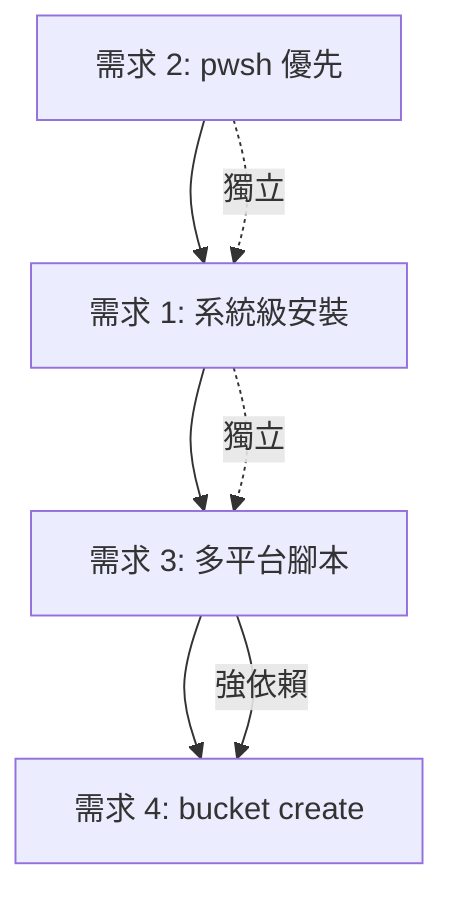

# Wenget 重構開發計畫

> 基於 [重構需求評估報告](./refactoring-evaluation.md) 建立
> 
> 建立日期: 2026-01-02

---

## 概覽

| 項目 | 內容 |
|------|------|
| **總工期** | 約 12.5 天 (2.5 週) |
| **需求數量** | 4 個 |
| **優先順序** | 需求2 → 需求1 → 需求3 → 需求4 |

### 依賴關係



---

## 里程碑時程

| 里程碑 | 預計完成日 | 說明 |
|--------|-----------|------|
| M1: pwsh 優先實作 | Day 1 | 快速勝利，風險最低 |
| M2: 系統級安裝完成 | Day 4 | 核心路徑重構完成 |
| M3: 多平台腳本格式上線 | Day 6.5 | 破壞性變更，需版本升級 |
| M4: bucket create 命令完成 | Day 11 | 替代 Python 腳本 |
| M5: 整合測試與文檔 | Day 12.5 | 發布準備 |

---

## Phase 1: pwsh 優先 (需求 2)

**工期:** 0.5 天  
**風險等級:** 🟢 低  
**複雜度:** 簡單

### 目標
讓 Windows 平台的 PowerShell 腳本 shim 優先使用 `pwsh`（如果可用），否則退回 `powershell`。

### 任務清單

- [ ] **P1-1: 實作 pwsh 偵測函數**
  - 檔案: `src/installer/script.rs`
  - 新增 `get_powershell_command()` 函數
  - 使用 `OnceLock` 快取偵測結果
  - 預估: 1 小時

- [ ] **P1-2: 修改 Windows shim 生成邏輯**
  - 檔案: `src/installer/script.rs`
  - 修改 `create_script_shim_windows()` 函數
  - 將硬編碼的 "powershell" 替換為動態偵測結果
  - 預估: 1 小時

- [ ] **P1-3: 單元測試**
  - 新增 `get_powershell_command()` 測試
  - 驗證 shim 內容正確性
  - 預估: 1 小時

- [ ] **P1-4: 更新 CHANGELOG**
  - 記錄此改進
  - 預估: 0.5 小時

### 驗收標準
- [x] 在安裝有 pwsh 的系統上，shim 使用 `pwsh`
- [x] 在僅有 powershell 的系統上，shim 使用 `powershell`
- [x] 所有現有測試通過

---

## Phase 2: 系統級安裝 (需求 1)

**工期:** 3 天  
**風險等級:** 🟡 中  
**複雜度:** 中等

### 目標
讓 wenget 在以 root/Administrator 身分執行時，將程式安裝在系統目錄。

| 平台 | 應用程式目錄 | Bin 目錄 |
|------|------------|----------|
| Linux | `/opt/wenget/app` | `/usr/local/bin` (symlinks) |
| Windows | `%ProgramW6432%\wenget\app` | `%ProgramW6432%\wenget\bin` (加入 PATH) |

### 任務清單

#### 2.1 權限偵測 (預估: 0.5 天)

- [ ] **P2-1: 新增權限偵測模組**
  - 新增檔案: `src/core/privilege.rs`
  - Linux: 使用 `libc::geteuid()`
  - Windows: 使用 `is_elevated` crate 或 Windows API
  - 匯出 `is_elevated()` 函數

- [ ] **P2-2: 新增 crate 依賴**
  - `Cargo.toml`: 新增 `libc` (Unix) 
  - `Cargo.toml`: 新增 `is_elevated` 或 `windows-sys` (Windows)

#### 2.2 路徑管理重構 (預估: 1 天)

- [ ] **P2-3: 重構 WenPaths 結構**
  - 檔案: `src/core/paths.rs`
  - 新增 `is_system_install: bool` 欄位
  - 修改 `new()` 根據權限選擇路徑
  - 修改 `bin_dir()` 返回正確的 bin 目錄

- [ ] **P2-4: 新增系統路徑常數**
  - Linux: `/opt/wenget`, `/usr/local/bin`
  - Windows: `%ProgramW6432%\wenget`

- [ ] **P2-5: 修改相關輔助方法**
  - `apps_dir()`, `app_dir()`, `cache_dir()` 等

#### 2.3 Windows PATH 註冊 (預估: 0.5 天)

- [ ] **P2-6: 新增 Windows 註冊表操作**
  - 新增檔案: `src/core/registry.rs` (僅 Windows)
  - 實作 `add_to_system_path()` 函數
  - 實作 `remove_from_system_path()` 函數
  - 新增 `winreg` crate 依賴

- [ ] **P2-7: 修改 init 命令**
  - 檔案: `src/commands/init.rs`
  - 系統安裝時呼叫 `add_to_system_path()`

#### 2.4 Linux 符號連結 (預估: 0.3 天)

- [ ] **P2-8: 修改符號連結邏輯**
  - 檔案: `src/installer/symlink.rs`
  - 系統安裝時連結到 `/usr/local/bin`
  - 處理已存在檔案的衝突

#### 2.5 解除安裝處理 (預估: 0.3 天)

- [ ] **P2-9: 修改 delete 命令**
  - 檔案: `src/commands/delete.rs`
  - 系統安裝時需檢查權限
  - Windows: 移除 PATH 登錄

#### 2.6 測試與文檔 (預估: 0.4 天)

- [ ] **P2-10: 新增單元測試**
  - 權限偵測測試
  - 路徑生成測試

- [ ] **P2-11: 整合測試** *(需要管理員權限)*
  - Linux: 以 root 執行安裝/解除安裝
  - Windows: 以 Administrator 執行安裝/解除安裝

- [ ] **P2-12: 更新文檔**
  - README: 新增系統安裝說明
  - CHANGELOG: 記錄新功能

### 驗收標準
- [x] 一般用戶執行時，行為與現在相同 (~/.wenget)
- [x] root/Admin 執行時，使用系統目錄
- [x] Windows: bin 目錄正確加入系統 PATH
- [x] Linux: 可執行檔正確連結到 /usr/local/bin
- [x] 解除安裝正確清理

---

## Phase 3: 多平台腳本支援 (需求 3)

**工期:** 2.5 天  
**風險等級:** 🟡 中  
**複雜度:** 中等

> [!WARNING]
> 這是**破壞性變更**，舊格式 manifest 將無法使用。
> 建議此版本升級為 **v1.0**。

### 目標
修改 `ScriptItem` 數據結構，支援同一腳本在不同平台 (bash/powershell) 的多個版本。

### 新格式範例
```json
{
  "name": "rclonemm",
  "description": "Manage rclone mount through ssh config.",
  "repo": "https://gist.github.com/superyngo/f74f4749882df654dfdf286b7f718a9e",
  "platforms": {
    "bash": {
      "url": "https://gist.githubusercontent.com/.../rclonemm.sh"
    },
    "powershell": {
      "url": "https://gist.githubusercontent.com/.../rclonemm.ps1"
    }
  }
}
```

### 任務清單

#### 3.1 數據結構修改 (預估: 0.5 天)

- [ ] **P3-1: 新增 ScriptPlatform 結構**
  - 檔案: `src/core/manifest.rs`
  - 新增 `ScriptPlatform` 結構 (url, checksum)

- [ ] **P3-2: 修改 ScriptItem 結構**
  - 檔案: `src/core/manifest.rs`
  - 移除 `url` 和 `script_type` 欄位
  - 新增 `platforms: HashMap<ScriptType, ScriptPlatform>`

- [ ] **P3-3: 實作平台選擇邏輯**
  - 新增 `ScriptItem::get_compatible_script()` 方法
  - 新增 `ScriptItem::available_platforms()` 方法
  - Windows 優先: PowerShell > Batch > Python > Bash
  - Unix 優先: Bash > Python > PowerShell

- [ ] **P3-4: 為 ScriptType 實作 Hash trait**
  - 讓 `ScriptType` 可作為 HashMap key

#### 3.2 Cache 層修改 (預估: 0.5 天)

- [ ] **P3-5: 修改 CachedScript 結構**
  - 檔案: `src/cache.rs`
  - 對應新的 ScriptItem 格式

- [ ] **P3-6: 修改 cache 序列化/反序列化**
  - 確保新格式正確讀寫

#### 3.3 命令層修改 (預估: 1 天)

- [ ] **P3-7: 修改 add 命令**
  - 檔案: `src/commands/add.rs`
  - 呼叫 `get_compatible_script()` 選擇最佳平台
  - 當無適合平台時給出清晰錯誤
  - 顯示選擇的平台版本

- [ ] **P3-8: 修改 info 命令**
  - 檔案: `src/commands/info.rs`
  - 列出所有可用平台
  - 標註當前平台的相容性

- [ ] **P3-9: 修改 list 命令**
  - 檔案: `src/commands/list.rs`
  - 顯示腳本支援的平台數量
  - 例: `rclonemm (bash, powershell)`

- [ ] **P3-10: 修改 search 命令**
  - 檔案: `src/commands/search.rs`
  - 搜尋結果顯示平台資訊

#### 3.4 測試與文檔 (預估: 0.5 天)

- [ ] **P3-11: 單元測試**
  - `ScriptItem` 序列化/反序列化
  - `get_compatible_script()` 在不同平台的行為
  - 邊界情況: 只有一個平台、無相容平台

- [ ] **P3-12: 整合測試**
  - 安裝多平台腳本
  - 驗證正確選擇平台

- [ ] **P3-13: 更新文檔**
  - README: 說明新格式
  - CHANGELOG: 標註為破壞性變更
  - 版本升級說明

### 驗收標準
- [x] 新格式 manifest 正確解析
- [x] 適合當前平台的腳本被自動選擇
- [x] info 命令顯示所有可用平台
- [x] 無相容平台時給出清晰錯誤訊息

---

## Phase 4: Bucket Create 命令 (需求 4)

**工期:** 4.5 天  
**風險等級:** 🟡 中  
**複雜度:** 中等

> [!IMPORTANT]
> 此 Phase 依賴 Phase 3 完成，因為需要產生新格式的多平台腳本。

### 目標
新增 `wenget bucket create` 命令，替代 Python 腳本，從源文件生成 manifest.json。

### 命令格式
```bash
wenget bucket create --reposrc <URL|PATH> --scriptsrc <URL|PATH> -o manifest.json
```

### 任務清單

#### 4.1 Gist Provider (預估: 1.5 天)

- [ ] **P4-1: 新增 Gist API 結構體**
  - 新增檔案: `src/providers/gist.rs`
  - `Gist` 結構: id, description, html_url, files
  - `GistFile` 結構: filename, raw_url, size

- [ ] **P4-2: 實作 GistProvider**
  - `new()` 建構函數
  - `parse_gist_url()` 從 URL 提取 Gist ID
  - `fetch_gist()` 呼叫 GitHub API

- [ ] **P4-3: 實作腳本提取邏輯**
  - `extract_scripts()` 方法
  - 按檔名分組 (同名不同副檔名)
  - 產生新格式的 `ScriptItem`

- [ ] **P4-4: 單元測試**
  - Gist URL 解析測試
  - 腳本分組邏輯測試

#### 4.2 源文件解析器 (預估: 0.5 天)

- [ ] **P4-5: 新增 SourceParser**
  - 新增檔案: `src/providers/source_parser.rs`
  - `parse_source_file()` 去除註釋和空行
  - `read_source()` 支援 URL 和本地檔案

- [ ] **P4-6: 單元測試**
  - 解析測試
  - URL/本地檔案讀取測試

#### 4.3 Manifest 生成器 (預估: 1.5 天)

- [ ] **P4-7: 新增 bucket create 命令**
  - 新增檔案: `src/commands/bucket/create.rs`
  - 實作 `run_create()` 函數
  - 呼叫現有的 `GitHubProvider::fetch_package()`

- [ ] **P4-8: 處理 repos 源**
  - 迭代 repo URLs
  - 錯誤處理: 單一失敗不中斷
  - 進度顯示

- [ ] **P4-9: 處理 scripts 源**
  - 區分 Gist URL 和 raw script URL
  - Gist: 使用 `GistProvider`
  - Raw: 直接下載並偵測類型(可選，初版可跳過)

- [ ] **P4-10: 輸出 manifest.json**
  - 使用 `serde_json::to_string_pretty()`
  - 顯示統計資訊

#### 4.4 CLI 整合 (預估: 0.5 天)

- [ ] **P4-11: 更新 CLI 定義**
  - 檔案: `src/cli.rs`
  - 新增 `BucketCommands::Create` variant
  - 參數: `--reposrc`, `--scriptsrc`, `-o/--output`

- [ ] **P4-12: 更新命令路由**
  - 檔案: `src/main.rs`
  - 新增 `BucketCommands::Create` 分支

- [ ] **P4-13: 更新 providers mod**
  - 檔案: `src/providers/mod.rs`
  - 匯出 `gist` 和 `source_parser` 模組

#### 4.5 測試與文檔 (預估: 0.5 天)

- [ ] **P4-14: 整合測試**
  - 使用實際的 sources_repos.txt
  - 使用實際的 sources_scripts.txt
  - 驗證產出的 manifest.json

- [ ] **P4-15: 更新文檔**
  - README: 新增 bucket create 說明
  - 範例使用方式
  - CHANGELOG: 記錄新命令

### 驗收標準
- [x] `wenget bucket create --reposrc <file>` 產生有效的 packages
- [x] `wenget bucket create --scriptsrc <file>` 產生有效的 scripts (新格式)
- [x] 輸出的 manifest.json 可被 wenget 正確解析
- [x] 單一 repo/script 失敗不中斷整體流程

---

## Phase 5: 整合測試與發布準備

**工期:** 1.5 天  
**風險等級:** 🟢 低

### 任務清單

- [ ] **P5-1: 全面回歸測試**
  - 執行所有單元測試
  - 手動測試主要流程

- [ ] **P5-2: 跨平台驗證**
  - Windows: 一般用戶 + Administrator
  - Linux: 一般用戶 + root
  - macOS: 一般用戶 (如有環境)

- [ ] **P5-3: 更新 bucket manifest**
  - 使用新的 `bucket create` 生成
  - 驗證新格式正確

- [ ] **P5-4: 版本升級**
  - 更新 `Cargo.toml` 版本號 (建議 v1.0.0)
  - 更新 README 說明

- [ ] **P5-5: 發布 CHANGELOG**
  - 整理所有變更
  - 標註破壞性變更
  - 說明遷移步驟

- [ ] **P5-6: 建立發布 tag**
  - Git tag: v1.0.0
  - 觸發 CI/CD 建置

---

## 附錄

### A. 新增/修改檔案清單

#### 新增檔案
- `src/core/privilege.rs` - 權限偵測
- `src/core/registry.rs` - Windows 註冊表操作 (僅 Windows)
- `src/providers/gist.rs` - Gist API 客戶端
- `src/providers/source_parser.rs` - 源文件解析器
- `src/commands/bucket/create.rs` - bucket create 命令

#### 修改檔案
- `src/core/paths.rs` - 系統/用戶路徑邏輯
- `src/core/manifest.rs` - ScriptItem 新格式
- `src/cache.rs` - CachedScript 新格式
- `src/installer/script.rs` - pwsh 偵測
- `src/installer/symlink.rs` - 系統連結路徑
- `src/commands/add.rs` - 多平台腳本選擇
- `src/commands/info.rs` - 顯示多平台
- `src/commands/list.rs` - 顯示平台資訊
- `src/commands/search.rs` - 顯示平台資訊
- `src/commands/init.rs` - 系統安裝初始化
- `src/commands/delete.rs` - 系統解除安裝
- `src/cli.rs` - 新增 Create 命令
- `src/main.rs` - 命令路由
- `src/providers/mod.rs` - 模組匯出

### B. 新增 Crate 依賴

| Crate | 版本 | 用途 | 平台 |
|-------|------|------|------|
| `libc` | latest | Unix 權限偵測 | Unix only |
| `is_elevated` 或 `windows-sys` | latest | Windows 權限偵測 | Windows only |
| `winreg` | latest | Windows 註冊表 | Windows only |

### C. 破壞性變更說明

**ScriptItem 格式變更:**

舊格式 (不再支援):
```json
{
  "name": "rclonemm",
  "url": "https://..../rclonemm.sh",
  "script_type": "bash"
}
```

新格式:
```json
{
  "name": "rclonemm",
  "platforms": {
    "bash": { "url": "https://..../rclonemm.sh" },
    "powershell": { "url": "https://..../rclonemm.ps1" }
  }
}
```

**遷移步驟:**
1. 使用 `wenget bucket create` 重新生成 manifest
2. 或手動轉換現有 manifest 格式

---

## 檢查點

- [ ] Phase 1 完成 (Day 1)
- [ ] Phase 2 完成 (Day 4)
- [ ] Phase 3 完成 (Day 6.5)
- [ ] Phase 4 完成 (Day 11)
- [ ] Phase 5 完成 (Day 12.5)
- [ ] **v1.0.0 發布**
